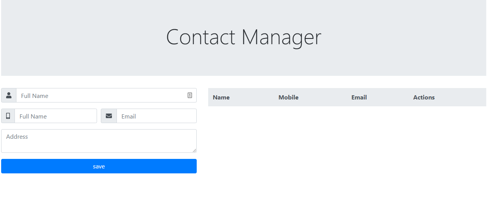
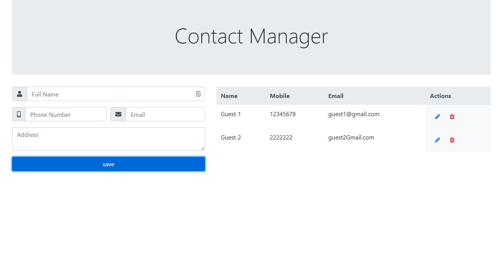

# CRUD-React-Firebase-Bootstrap

It is a web App that do CRUD operations on a Firebase DB.

## Table of content

- Usage.
- Technologies used.
- Installation.
- Contributing.
- License.

## Screenshots



## Usage

CRUD-React-Firebase-Bootstrap is can be your backbone\
 for a big project that includes Firebase DB manipulations.

## Technologies used

- React [Hooks included]
- Firebase
- Bootstrap
- Fontawesome

## Requirements

- Code Editor (i.e: VScode)
- Browser (i.e: Chrome)
- Stable internet Connection

## Installation

Before starting, please make sure you have npm installed by\
 running this command in your terminal as administrator

```bash
npm -v
```

First, install node

```bash
npm install node
```

Second, install Bootstrap

```bash
npm install --save bootstrap
```

Third, install Firebase

```bash
npm install --save firebase
```

Fourth, install Fontawesome

```bash
npm install --save @fortawesome/fontawesome-svg-core
npm install --save @fortawesome/free-solid-svg-icons
npm install --save @fortawesome/react-fontawesome
```

## Contributing

Pull requests are welcome. For major changes, please open\
 an issue first to discuss what you would like to change.

Please make sure to update tests as appropriate.

## License

[MIT](https://choosealicense.com/licenses/mit/)
